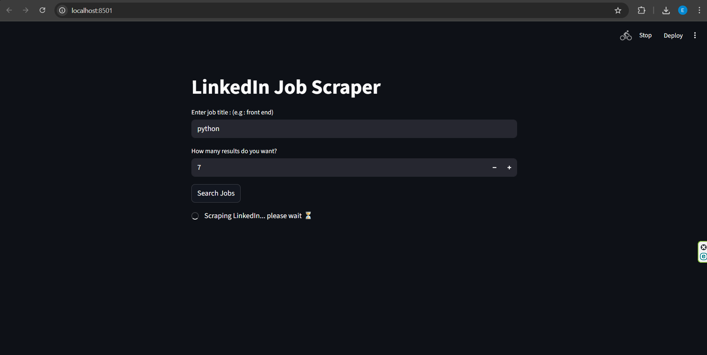
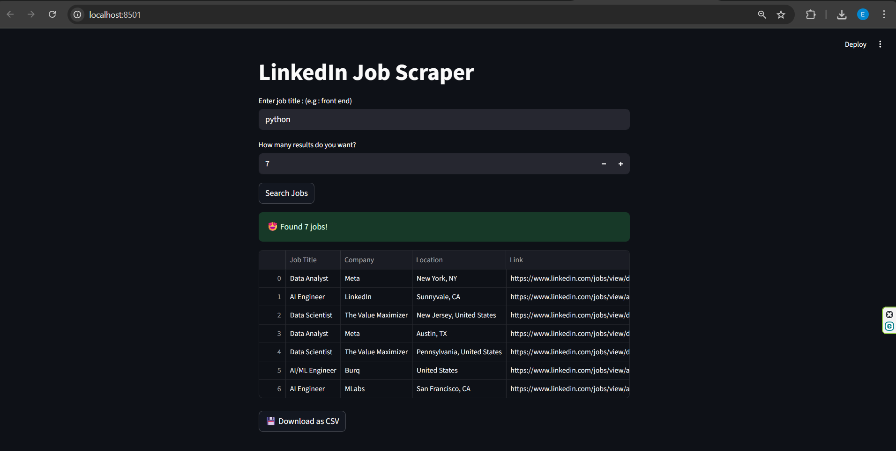

# LinkedIn Job Scraper

A simple tool to scrape job listings from LinkedIn using **Selenium** and a **Streamlit UI**.  
You can search for a job title, choose how many results you want, and download the results as a CSV file.

---

## 🦋 Features
- Search for job titles on LinkedIn  
- Extract key information for each job posting:
  - Job Title  
  - Company Name  
  - Location  
  - Direct Job Link  
- Choose number of results
- View results in a table
- Download jobs as CSV
- Simple and clean UI with Streamlit

---

## 🛠 Requirements
- Python 3.8+
- Selenium
- pandas
- webdriver-manager
- streamlit

---

## ⚙️ Installation & Setup

1. Clone the repository
```bash
git clone https://github.com/ElheHabibi/linkedin-job-scraper.git
cd linkedin-job-scraper
```

2. Install dependencies
```bash
pip install -r requirements.txt
```
---

## ▶ Run
```bash
streamlit run scraper.py
```
---

## 👀 Demo

### Input
Enter job title and number of results, then click **Search Jobs**:



### Output
Results will be shown in a table, and you can download them as a CSV:



---

## 📝 Notes
- ChromeDriver is automatically downloaded and managed by `webdriver_manager`.
- LinkedIn may occasionally impose restrictions or CAPTCHAs.
- **Important for users in Iran:** Due to restrictions, downloading ChromeDriver may require a VPN/proxy.
